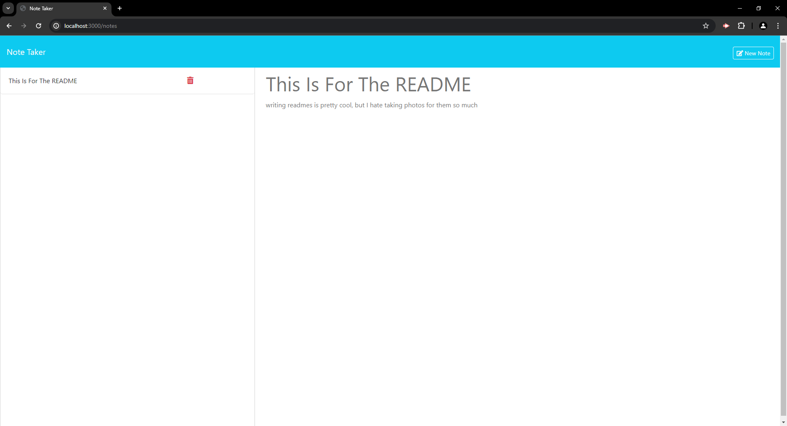

# Taking Notes

## Description

This is a site used for taking notes, the notes can have a title and description, and will be saved for later uses.

## Installation

N/A

## Usage

when you open the page you will see a page with a get started button click the get started button and it will take you to the note taking page. Worry not though! If you would like to get back to the homepage you can click the words note taker in the top left at any time to return. Once on the page you can enter your note title and note text, as you type in either box a clear form button will appear in the upper right that you can click to reset the form. Once text has been entered in bot the title and text categories in the upper right you will see a save note button appear. You may click this if you do feel so inclined to save the note in the column on the left side of the screen. Now you don't have to, but if you'd like to you can click your saved notes on the left to view them, but beware there is a trashcan icon on the right side of them that will completely delete the note if clicked. once the note is in full view you can read the text inside of it, a new note button will also appear in the upper right to take you back to where you can make a new note or delete old notes.

## Credits

N/A

## License

Please refer to the LICENSE in the repo.